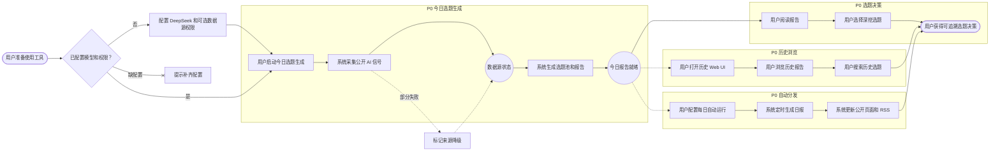
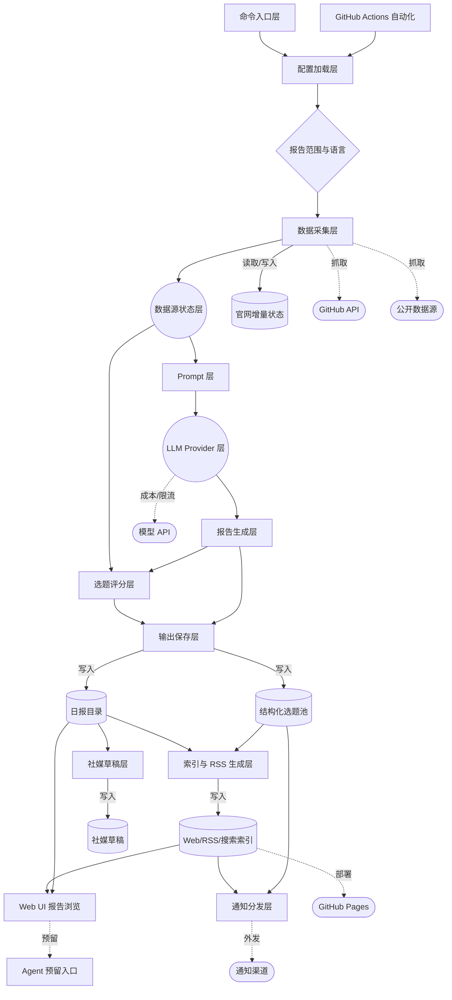

# AI Trend Radar

面向产品和行业调研的热点选题监控工具。它会每天抓取公开 AI 信号（国内外共 15+ 数据源），生成一份中文"值得写、值得测、值得深挖"的选题池，并通过 HTML、Web UI、RSS、Telegram、飞书和 GitHub Actions 分发。

它不是一个简单的信息搬运脚本，而是把分散的 AI 行业信号转成可排序、可解释、可交付的选题决策流：先采集公开证据，再用评分框架判断优先级，最后沉淀成报告、结构化数据和自动化分发链路。


> **关联项目**：本仓库的扩展版本 [AI-TREND-RADAR-RAG](https://github.com/Conradgui/AI-TREND-RADAR-RAG) 在数据管道基础上构建了 Graph RAG + Agentic RAG 智能查询系统，支持通过自然语言对话查询历史选题数据、分析趋势。详见[开发方向](#关联项目与开发方向)。

## 用户主要路径

用户配置必要权限后，AI Trend Radar 自动采集多源 AI 信号，生成带分数、分类、行动建议、理由和证据的选题池；用户据此完成当天选题决策，并可以通过 Web UI、RSS、历史索引继续浏览和复盘。

| 路径 | 用户目标 | 成功标准 |
| --- | --- | --- |
| P0_001 | 首次配置并生成今日 AI 选题池 | 生成主报告、HTML 报告、`topic-pool.json`，选题池非空且有证据 |
| P0_002 | 阅读报告并完成选题决策 | 用户能解释为什么某些话题值得深挖、入池、观察或归档 |
| P0_003 | 浏览历史报告与搜索历史选题 | 历史报告、日期列表、搜索、RSS 可用 |
| P0_004 | 每日自动运行并公开分发 | GitHub Actions、manifest、RSS、GitHub Pages 更新 |



P1 扩展路径包括源级报告、周报/月报、通知推送、社媒草稿、GitHub Issue 记录和语言/范围配置。P2 异常路径覆盖模型 Key 缺失、429/403/超时、GitHub 限流、可选数据源缺 token、历史状态损坏、索引/RSS 损坏、通知失败和上游异常内容。

## 5 分钟理解

### 它解决什么问题？

每天 AI 信息源很多：新模型、新产品、开源项目、论文、Hacker News 讨论、大厂官网发布、国内外社区文章。AI Topic Radar 把这些公开信号聚合成一个可操作的内容选题池，帮助你判断：

- 今天哪些 AI 话题值得优先深挖？
- 哪些产品或开源项目值得进入选题池？
- 中英文社区对同一话题的讨论有何异同？
- 哪些数据源失败了，应该怎么修？

### 最终会产出什么？

| 文件 | 用途 |
| --- | --- |
| `digests/YYYY-MM-DD/ai-topic-radar.html` | 主报告，可双击打开 |
| `digests/YYYY-MM-DD/ai-topic-radar.md` | Markdown 版本 |
| `digests/YYYY-MM-DD/topic-pool.json` | 结构化选题池（分数、分类、动作、理由、证据） |
| `digests/YYYY-MM-DD/ai-china-tech.md` | 中文科技社区 AI 动态日报（36kr + InfoQ + Gitee + OSChina + 掘金） |
| `manifest.json` | 历史 Web UI 侧边栏索引 |
| `digests/search-index.json` | 历史选题搜索索引 |
| `feed.xml` | RSS 订阅源 |

### 适合谁？

- AI 内容研究者 / 趋势研究者 / 科技媒体编辑：每天筛选值得写、值得深挖的 AI 话题
- 独立创作者 / Newsletter 作者 / 社区运营：把多源 AI 信息转成可发布内容
- AI 产品、战略、市场、行研、咨询、投资相关角色：跟踪新产品、新模型、竞品和生态变化
- AI PM 候选人：用真实项目训练趋势判断、证据判断、优先级判断和面试表达

## 最快跑通

```bash
# 1. 安装依赖
pnpm install --frozen-lockfile

# 2. 配置 API Key
cp .env.example .env
# 编辑 .env，填入 LLM_PROVIDER 和对应 API_KEY

# 3. 运行
pnpm digest
```

成功后打开 `digests/YYYY-MM-DD/ai-topic-radar.html`。

查看历史看板：`pnpm serve` → http://localhost:8080

## 数据源（15+ 个）

### 国际数据源

| 来源 | 内容 | 配置 |
| --- | --- | --- |
| GitHub Trending | 每日热门开源仓库 | 无需 token |
| GitHub Search | `llm`、`ai-agent`、`rag` 等关键词 | 推荐 `GITHUB_TOKEN` |
| Hacker News | AI / LLM 社区讨论 | 无需 token |
| Product Hunt | AI 产品发布 | 需要 `PRODUCTHUNT_TOKEN` |
| arXiv | `cs.AI`、`cs.CL`、`cs.LG` 论文 | 无需 token |
| Hugging Face | 热门模型和下载/点赞信号 | 无需 token |
| OpenAI 官网 | 官方发布、产品更新 | 无需 token |
| Anthropic 官网 | Claude、模型、安全动态 | 无需 token |
| **Google DeepMind** | 研究博客、论文、产品发布 | 无需 token |
| Dev.to | 技术社区文章 | 无需 token |
| Lobsters | 技术社区讨论 | 无需 token |

### 国内数据源

| 来源 | 内容 | 访问方式 |
| --- | --- | --- |
| 36kr | AI 行业新闻 | RSS feed |
| InfoQ 中国 | 技术深度文章 | 内部 API |
| Gitee | 热门 AI 开源项目 | REST API v5 |
| 开源中国 | 技术资讯 | RSS feed |
| 稀土掘金 | 开发者技术文章 | 内部 API |

五个国内源合并为一份 `ai-china-tech.md` 报告（中英文版本），并同时纳入选题评分。

某个来源失败不会中断日报，主报告会在"数据源状态与修复提示"里说明原因。

状态语义：

- `ok`：来源成功返回并产出内容。
- `empty`：来源成功访问，但本轮没有符合条件的新内容；不等同于故障。
- `skipped`：缺少可选 token 或配置，主动跳过。
- `error`：网络、接口结构或上游返回异常；HTTP 200 但返回拦截页、HTML 或异常 XML 也会标记为失败。

Gitee 是尽力而为来源，空结果或部分关键词失败不会阻断日报。

选题排序优先级默认按一手程度处理：OpenAI / Anthropic / Google DeepMind 官网优先，其次是产品、模型、开源和国际社区信号；国内媒体和国内开发者社区作为补充观察源。

## 功能模块总览

| 模块 | 能力 | 默认 |
| --- | --- | --- |
| 数据采集 | 15+ 国内外源（GitHub、HN、arXiv、HF、官网、36kr、掘金等） | 是 |
| LLM 摘要 | DeepSeek / Anthropic / OpenAI / OpenRouter / GitHub Copilot | 是 |
| 选题评分 | 商业影响 40、热度 30、新鲜度 20、可写性 10 | 是 |
| 内容分类 | 政策监管、模型突破、AI 产品、行业落地、标杆企业与商业格局 | 是 |
| 中文科技社区报告 | `ai-china-tech.md`（36kr + InfoQ + Gitee + OSChina + 掘金） | 是 |
| 搜索索引 | `digests/search-index.json`，从每日 `topic-pool.json` 生成 | 是 |
| 源级报告 | `ai-web.md`、`ai-hn.md`、`ai-arxiv.md` 等 | 默认关闭 |
| 英文报告 | `*-en.md` | 默认关闭 |
| 历史 Web UI | `index.html` + `manifest.json` | 是 |
| RSS | `feed.xml` | 是 |
| Telegram / 飞书 | 通知推送 | 需 token |
| GitHub Actions | 每日 / 每周 / 每月自动运行 | 是 |

## 主线架构图

本仓库主线是 AI 信息搜索与选题雷达：采集公开信号，调用 LLM 生成摘要和判断，再沉淀为报告、结构化选题池、Web UI、RSS 和自动化分发。Web UI 中的 Agent 入口是后续 RAG 项目的预留入口，用虚线表示，不纳入当前主线能力。



## 选题评分

```text
总分 = 商业影响（40）+ 热度（30）+ 新鲜度（20）+ 可写性（10）
```

| 分数 | 动作 |
| ---: | --- |
| 80+ | 深挖 |
| 65-79 | 入池 |
| 50-64 | 观察 |
| < 50 | 归档 |

五类分类：
- 政策监管、社会影响与 AI 安全
- 模型与技术突破
- AI 产品与用户入口
- 企业落地与行业应用
- 标杆企业动向、商业格局与投融资

选题池还有几条约束：

- `topic-pool.json` 的主数据字段是 `candidates`；历史版本的 `topics` 会继续被搜索索引兼容读取。
- 候选池会按 URL 去重。
- 官网一手内容会获得更高排序权重；HTTP 200 但结构异常的官网响应仍会标记为失败。
- GitHub + Gitee 仓库类候选最多保留 16 条，避免开源仓库长期挤满 60 个候选位。
- Gitee 单源最多 3 条。
- GitHub 仓库热度使用对数计分，高 star 仍有优势，但不会仅凭总 star 挤掉其他来源。
- 国内源拆分为国内媒体（InfoQ 中国、36kr）和国内开发者社区（开源中国、掘金）；国内源合计最多 6 条。
- 掘金单源最多 2 条，定位为补充社区观察，不作为 Top 深挖主来源。
- Dev.to 和 Lobsters 社区内容会进入选题池，不只生成社区报告。
- 50-64 分是"观察项"。如果当天没有观察项，报告会显示说明文案；这不代表采集失败。

## 三种使用方式

### 方式一：本地使用

```bash
pnpm digest
# 打开 digests/YYYY-MM-DD/ai-topic-radar.html
```

### 方式二：GitHub Actions 自动日报

1. 配置 `DEEPSEEK_API_KEY` 为仓库 Secret
2. 进入 `Actions -> Daily AI Topic Radar -> Run workflow`
3. 成功后仓库自动生成新的 digest 文件

### 方式三：GitHub Pages 公开分享

1. `Settings -> Pages` → Source 选择 `GitHub Actions`
2. 等待日报 workflow 成功后自动部署
3. 访问 https://conradgui.github.io/AI-TREND-RADAR

## 自动化

| Workflow | 时间 |
| --- | --- |
| Daily | 每天 08:00 CST |
| Weekly | 每周一 09:00 CST |
| Monthly | 每月 1 日 10:00 CST |

通知：Telegram / 飞书 / SMTP 邮箱。未配置 token 时自动跳过。

## 常用命令

| 命令 | 作用 |
| --- | --- |
| `pnpm digest` | 生成主报告 + manifest + RSS |
| `pnpm start` | 只生成日报文件 |
| `pnpm manifest` | 更新 manifest.json 和 feed.xml |
| `pnpm serve` | 本地查看历史 Web UI |
| `pnpm weekly` | 生成周报 |
| `pnpm monthly` | 生成月报 |
| `pnpm test` | Vitest 单元/集成测试 |
| `pnpm typecheck` | TypeScript 类型检查 |

## 验证与 Benchmark 结论

本项目按“用户路径 → 架构节点 → 测试类型 → Benchmark 任务”的方式验证，不只证明代码能跑，也验证它是否能作为信息搜索产品稳定地产出可解释选题。

### 自动化检查

| 检查项 | 结果 |
| --- | --- |
| TypeScript typecheck | 通过 |
| ESLint | 通过 |
| Vitest | 284 passed / 1 skipped |
| 真实 API 可用性 | DeepSeek 主路径通过；可选数据源缺 token 时降级交付 |

### Benchmark 对比

Benchmark 对比的是“AI Trend Radar 产品化流程”和“直接调用 DeepSeek 裸模型”。满分 60 分，任务覆盖端到端生成、AI PM 选题决策、多源证据、异常降级、评分透明度、新闻分类准确率和摘要切入角度质量。

| 任务 | Tool | Baseline | 差值 |
| --- | ---: | ---: | ---: |
| BM_001 今日 AI 选题池端到端生成 | 56 / 60 | 23 / 60 | +33 |
| BM_002 基于选题池做选题决策 | 57 / 60 | 19 / 60 | +38 |
| BM_003 多源证据覆盖与来源差异判断 | 54 / 60 | 23 / 60 | +31 |
| BM_004 异常数据与噪声下的可信降级 | 55 / 60 | 23 / 60 | +32 |
| BM_005 评分透明度与筛选规则复核 | 55 / 60 | 25 / 60 | +30 |
| BM_006 新闻分类准确率对比 | 48 / 60 | 22 / 60 | +26 |
| BM_007 新闻切入角度与摘要质量对比 | 49 / 60 | 18 / 60 | +31 |

| 指标 | Tool | Baseline | 结论 |
| --- | ---: | ---: | --- |
| 平均总分 | 53.4 / 60 | 21.9 / 60 | Tool 胜在结构化证据、可复跑、可追溯和产品化输出 |
| BM_006 分类准确率 | 5 / 6 | 5 / 6 | 分类命中数持平，不能说 Tool 分类更准 |
| BM_007 切入角度与摘要质量 | 8.4 / 10 | 5.4 / 10 | Tool 更能给出可用角度、证据和摘要 |

需要诚实表达的边界：

- 不能说“所有数据源全部成功”。更准确的说法是：真实不完美环境下仍可降级交付；在 GitHub 端配置完整信息源 token 后，可恢复更完整的信息覆盖。
- 不能说“分类准确率全面优于裸模型”。BM_006 显示分类命中数持平，但工具把分类变成了可复核、可审计、可复跑的产品流程。
- 当前本仓库主线是 AI 信息搜索与选题雷达；`rag/`、`services/agentdb/`、`mcp/` 属于实验性或预留代码，不作为主线 Benchmark 对象。

## 关联项目与开发方向

### AI-TREND-RADAR-RAG

扩展版本：https://github.com/Conradgui/AI-TREND-RADAR-RAG

本仓库是**数据管道**（采集 → 评分 → 报告 → 分发），RAG 仓库在此基础上增加了**智能查询层**：

```
AI-TREND-RADAR（本仓库）              AI-TREND-RADAR-RAG（扩展版本）
├── 15+ 数据源采集                    ├── 包含本仓库全部代码
├── LLM 摘要 + 选题评分               ├── Neo4j 知识图谱
├── 日报/周报/月报生成                ├── ChromaDB 向量搜索
├── Telegram/飞书/RSS 分发            ├── LangGraph ReAct Agent（6 工具）
└── GitHub Pages 展示                 └── Chat UI + MCP Worker
```

> 本仓库的 `rag/`、`services/agentdb/`、`mcp/` 目录是从 RAG 仓库引入的实验性代码，尚未接入主流程。正式版本请使用 RAG 仓库。

### 开发方向：Nexus-inspired Knowledge Engine

正在 RAG 仓库开发的下一代架构，目标是把分散的每日 AI 信号预编译为结构化知识，让 Agent 查询时直接获取已组织好的知识，而非每次从原始文档中检索：

```
Nexus-inspired Knowledge Engine
= Agentic RAG                          — Agent 自主决定何时检索、用哪个工具、如何综合
+ Pre-runtime Knowledge Compilation    — 每日 ingestion 阶段预编译知识制品
+ Knowledge Artifact Layer             — 结构化知识实体（话题图谱、趋势轨迹、实体关系）
+ Structured Knowledge Query           — 声明式查询（Cypher + 语义混合），不再依赖纯文本检索
+ Evidence & Governance Layer          — 每条结论可追溯到原始数据源和评分证据
+ Evaluation Feedback Loop             — 选题质量反馈驱动评分权重和分类规则的持续优化
```

当前进度：基础 Graph RAG（知识图谱构建 + 混合检索 + 6 工具 Agent）已完成，后续迭代预编译知识制品和声明式查询层。

## 作品集边界

本仓库只使用公开信息源和可复现代码，不包含公司内部资料、私有社群内容、API key 或未公开报告。它用于展示一个可公开复现的 AI 热点监控、选题评分、日报生成和自动分发工作流。

## License

MIT
